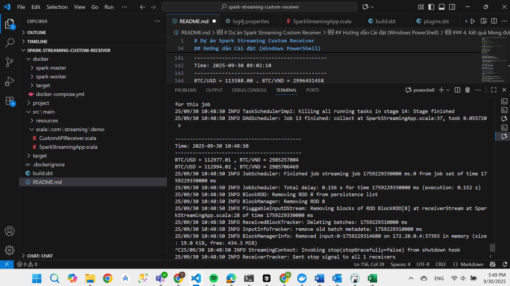

# Dự án Spark Streaming Custom Receiver

Dự án này minh họa cách tạo một ứng dụng Spark Streaming với custom receiver để lấy dữ liệu từ REST API công khai. Ứng dụng xử lý dữ liệu thời gian thực và có thể chạy trên Spark cluster được Docker hóa.

## Cấu trúc Dự án

```
CUSTOM-RECEIVER-DEMO
├── src
│   └── main
│       ├── scala
│       │   └── com
│       │       └── streaming
│       │           ├── demo
│       │           │   ├── CustomAPIReceiver.scala
│       │           │   └── SparkStreamingApp.scala
│       │           └── exercise
│       │               ├── EthereumReceiver.scala
│       │               └── EthereumStreamingApp.scala
│       └── resources
│           └── log4j.properties
├── project
│   ├── build.properties
│   └── plugins.sbt
├── docker
│   ├── docker-compose.yml
│   ├── spark-master
│   │   └── Dockerfile
│   └── spark-worker
│       └── Dockerfile
├── target
│   └── scala-2.12
│       └── spark-streaming-custom-receiver_2.12-0.1.0.jar
├── build.sbt
├── image.png
└── README.md
```

## Hướng dẫn Cài đặt (Windows PowerShell)

### 1. Di chuyển đến Thư mục Dự án

```powershell
cd "D:\4th\StreamingBigdata\CUSTOM-RECEIVER-DEMO"
```

### 2. Thiết lập Spark Cluster và Build JAR File

**2.1. Di chuyển đến thư mục docker:**
```powershell
cd docker
```

**2.2. Khởi động Docker Compose (sẽ tự động build JAR file):**
```powershell
docker-compose up -d
```
Lệnh này sẽ:
- Khởi động SBT builder service để compile và đóng gói JAR file
- Khởi động Spark Master với JAR files được mount
- Khởi động Spark Worker

**2.3. Chờ quá trình build hoàn thành và kiểm tra trạng thái:**
```powershell
# Chờ SBT build hoàn thành
Start-Sleep -Seconds 30

# Kiểm tra trạng thái tất cả services
docker-compose ps

# Kiểm tra JAR file đã được tạo
ls ../target/scala-2.12/
```

**2.4. Kiểm tra truy cập Spark UI:**
- Spark Master UI: [http://localhost:8080](http://localhost:8080)
- Spark Worker UI: [http://localhost:8081](http://localhost:8081)

**2.5. Kiểm tra build logs nếu cần:**
```powershell
docker-compose logs sbt-builder
```

### 3. Submit Spark Job

**3.1. Copy JAR file vào Spark Master và Submit job:**
```powershell
# Di chuyển về thư mục gốc của dự án
cd ..

# Copy JAR file vào master container (kiểm tra tên file thực tế trước)
docker cp target/scala-2.12/spark-streaming-custom-receiver_2.12-0.1.0.jar docker-spark-master-1:/opt/spark/app.jar

# Submit job vào Spark cluster
docker exec -it docker-spark-master-1 /opt/spark/bin/spark-submit --master spark://spark-master:7077 --class com.streaming.demo.SparkStreamingApp /opt/spark/app.jar
```

**Quan trọng:** Đảm bảo cả master và worker containers đang chạy trước khi submit job. Kiểm tra bằng:
```powershell
# Quay lại thư mục docker
cd docker

# Kiểm tra trạng thái container
docker-compose ps
# Tất cả services phải có trạng thái "Up"

# Nếu containers không chạy, khởi động chúng:
docker-compose up -d
```

**Xử lý sự cố với JAR file:**
```powershell
# Nếu không tìm thấy JAR file, kiểm tra tên file thực tế trong thư mục target
Get-ChildItem target\scala-2.12\*.jar

# Kiểm tra containers có đang chạy không
docker-compose ps

# Xem logs nếu có vấn đề
docker-compose logs spark-master
docker-compose logs spark-worker

# Restart containers nếu cần
docker-compose down
docker-compose up -d
```

### 4. Kết quả Mong đợi

**4.1. Output thành công:**
```
INFO StreamingContext: StreamingContext started
INFO ReceiverTracker: Starting 1 receivers
INFO ReceiverTracker: Registered receiver for stream 0
INFO JobScheduler: Added jobs for time [timestamp] ms
INFO JobScheduler: Total delay: [low ms] for time [timestamp] ms
```

**4.2. Xem dữ liệu streaming:**
Sau khi khởi động thành công, Custom Receiver sẽ lấy dữ liệu tỷ giá Bitcoin từ Coinbase API:
- Custom Receiver lấy dữ liệu Bitcoin rates mỗi 5 giây
- Spark xử lý dữ liệu theo batch 10 giây
- Kết quả hiển thị theo format:

```
-------------------------------------------
Time: 2025-09-30 09:02:10
-------------------------------------------
BTC/USD = 113388.00 , BTC/VND = 2996451458
BTC/USD = 113386.88 , BTC/VND = 2996421728

-------------------------------------------
```

**4.3. Ảnh chụp màn hình kết quả thực tế:**

**

**4.4. Rebuild sau khi thay đổi code:**
Nếu bạn sửa đổi source code (như thay đổi API URL):
```powershell
# Di chuyển về thư mục gốc dự án
cd ..

# Rebuild JAR file sử dụng Docker
docker run --rm -v ${PWD}:/workspace -w /workspace sbtscala/scala-sbt:eclipse-temurin-jammy-17.0.5_8_1.8.2_2.12.17 sbt clean package

# Copy JAR file mới vào master container
docker cp target/scala-2.12/spark-streaming-custom-receiver_2.12-0.1.0.jar docker-spark-master-1:/opt/spark/app.jar

# Submit job đã được cập nhật
docker exec -it docker-spark-master-1 /opt/spark/bin/spark-submit --master spark://spark-master:7077 --class com.streaming.demo.SparkStreamingApp /opt/spark/app.jar
```

### 5. Dừng Cluster

**5.1. Dừng Spark job:**
Nhấn `Ctrl+C` trong terminal đang chạy job, hoặc kill job từ Spark UI tại http://localhost:4040

**5.2. Dừng Docker containers:**
```powershell
# Đảm bảo bạn đang ở thư mục docker
cd docker

# Dừng tất cả containers
docker-compose down
```

## Xử lý Sự cố

**Nếu tên container khác:**
```powershell
# Kiểm tra tên container thực tế
docker ps

# Sử dụng tên container đúng trong các lệnh
docker exec -it <tên-container-thực-tế> <lệnh>
```

**Nếu Docker SBT build thất bại:**
```powershell
# Clean và rebuild sử dụng Docker
docker run --rm -v ${PWD}:/app -w /app sbtscala/scala-sbt:eclipse-temurin-jammy-17.0.5_8_1.8.2_2.12.17 sbt clean package

# Hoặc thử với SBT Docker image khác
docker run --rm -v ${PWD}:/workspace -w /workspace hseeberger/scala-sbt:17.0.2_1.6.2_2.13.8 sbt clean package
```

**Nếu ports đã được sử dụng:**
```powershell
# Kiểm tra process nào đang sử dụng port
netstat -ano | findstr :8080
# Dừng service xung đột hoặc thay đổi ports trong docker-compose.yml
```

## Tổng quan về Code

Dự án bao gồm hai package chính:

### Package `com.streaming.demo` - Bitcoin Rate Streaming

#### CustomAPIReceiver.scala
File này định nghĩa class `CustomAPIReceiver`, kế thừa từ `Receiver[String]`. Nó implement method `onStart()` để tạo thread lấy dữ liệu từ Coinbase API công khai mỗi 5 giây và đẩy kết quả vào Spark sử dụng method `store()`. Method `onStop()` dừng thread.

#### SparkStreamingApp.scala
File này chứa object `SparkStreamingApp` với main method. Nó khởi tạo `StreamingContext` với batch interval 10 giây, đọc dữ liệu từ `CustomAPIReceiver`, parse JSON để lấy tỷ giá BTC/USD và BTC/VND, và hiển thị kết quả theo format đẹp mắt.

### Package `com.streaming.exercise` - Ethereum Data Streaming

#### EthereumReceiver.scala
Tương tự `CustomAPIReceiver`, file này định nghĩa custom receiver để lấy dữ liệu Ethereum từ API công khai, xử lý streaming dữ liệu cryptocurrency Ethereum.

#### EthereumStreamingApp.scala
Ứng dụng streaming cho Ethereum, xử lý và hiển thị dữ liệu Ethereum real-time tương tự như Bitcoin streaming app.

### Resources

#### log4j.properties
File cấu hình để giảm thiểu log verbose của Spark, chỉ hiển thị kết quả streaming chính.

### Tài liệu

#### CASE_STUDY.md
Tài liệu mô tả chi tiết về case study, bao gồm bối cảnh, yêu cầu, vấn đề và giải pháp của dự án.

## Chạy các ứng dụng khác nhau

Dự án bao gồm hai ứng dụng streaming có thể chạy:

### Bitcoin Rate Streaming (Demo)
```powershell
docker exec -it docker-spark-master-1 /opt/spark/bin/spark-submit --master spark://spark-master:7077 --class com.streaming.demo.SparkStreamingApp /opt/spark/app.jar
```

### Ethereum Data Streaming (Exercise)
```powershell
docker exec -it docker-spark-master-1 /opt/spark/bin/spark-submit --master spark://spark-master:7077 --class com.streaming.exercise.EthereumStreamingApp /opt/spark/app.jar
```

## Kết luận

Dự án này cung cấp một ví dụ hoàn chỉnh về cách tạo ứng dụng Spark Streaming với custom receiver, chạy trên Spark cluster được Docker hóa, và theo dõi việc thực thi. Dự án bao gồm hai ví dụ thực tế: Bitcoin rate streaming và Ethereum data streaming. Bạn có thể mở rộng dự án này bằng cách thêm nhiều tính năng hoặc tích hợp thêm các nguồn dữ liệu khác theo nhu cầu.

---

**Xem thêm:** [CASE_STUDY.md](CASE_STUDY.md) để hiểu chi tiết về bối cảnh, yêu cầu và giải pháp kỹ thuật của dự án.
